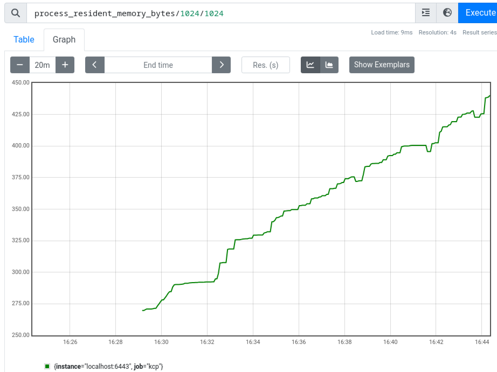
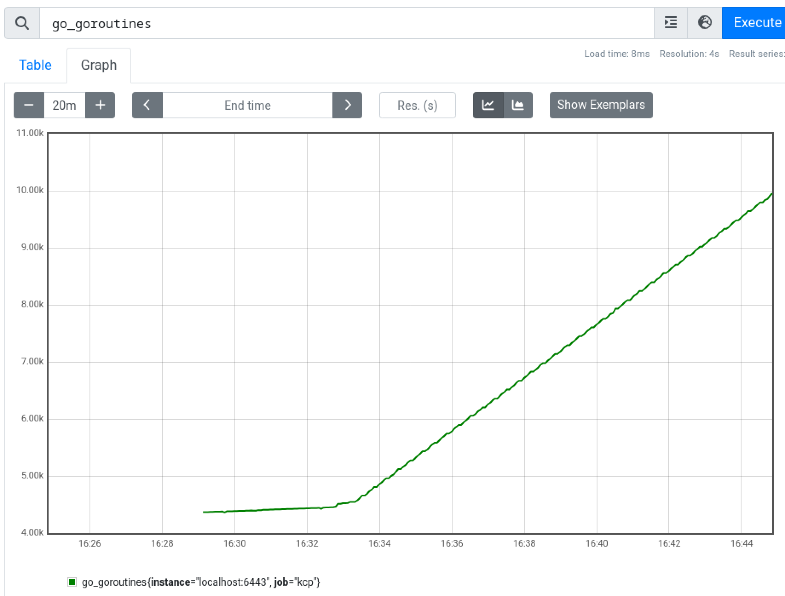

# KCP demo

This demo project is created to reproduce a [KCP bug](https://github.com/kcp-dev/kcp/issues/3016).




I have run this setup for some hours and the mesurments kept their trendency.

## In this repo

- I used OperatorSDK to scaffold the content of this repo
  - created the `Foo` resource with its controller

- downloaded the KCP binary, run locally

## Run

Prerequsites:
- place a KCP binary under: `./bin/kcp`

Hint: `tmux` helps

- run KCP: `make start-kcp`
- `export KUBECONFIG=$(pwd)/kcp/admin.kubeconfig`
- run the operator: `make run`

- run some stimulus: `./apply-loop.sh`

### Optional Prometheus

- place a Prometheus binary under: `./bin/prometheus`
- run it: `make prom`
  - `process_resident_memory_bytes/1024/1024`
  - `go_goroutines`


# Under the hood

# What does the controller do

The CRD that it works on:

```go
type FooSpec struct {
	Foo string `json:"foo,omitempty"`
}

type FooStatus struct {
	Message string `json:"message,omitempty"`
}
```

The controller could not be simpler.
It sets the status message to the `foo` field's value.

The simplified code:

```go
func (r *FooReconciler) Reconcile(ctx context.Context, req ctrl.Request) (ctrl.Result, error) {
    var instance demov1alpha1.Foo
    r.Get(ctx, req.NamespacedName, &instance)

    instance.Status.Message = instance.Spec.Foo
    r.Update(ctx, &instance)

    return ctrl.Result{}, nil
}
```
